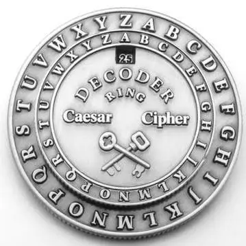
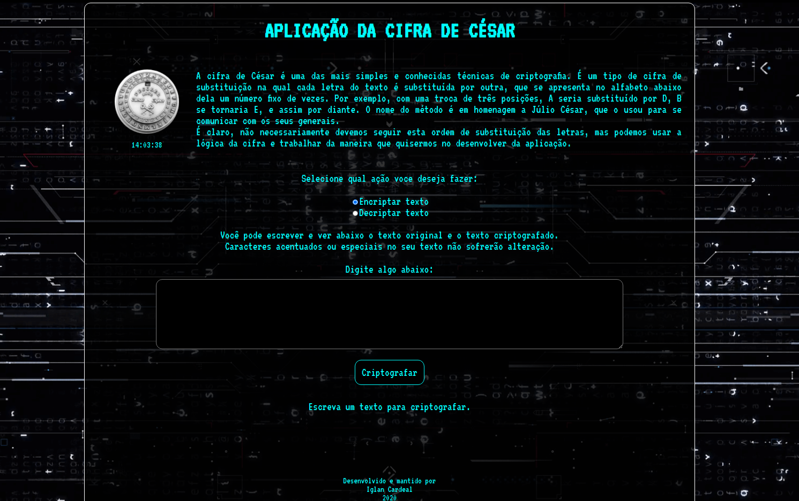
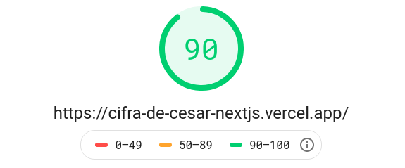
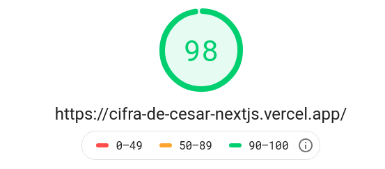

<div align="center">
  <kbd>
    
  </kbd>
  
# Cifra de César

<br>

### Site para usar a cifra de César para encriptar/descriptar texto

</div>

<div align="center">

      

</div>

---

## Status do projeto

- Concluído :muscle:

- [Veja o site online aqui](https://cifra-de-cesar-nextjs.vercel.app/) 👀 :computer:

## Tabela de conteúdos

<!--ts-->

- [Sobre o projeto](#sobre)
- [Como surgiu?](#porque)
- [Onde está hospedado](#host)
- [Como usar localmente](#como-usar)
  - [Pré Requisitos](#como-usar)
- [Tecnologias](#tecnologias)
- [Performance no PageSpeed](#pagespeed)
- [Autor](#autor)
<!--te-->

<p id="sobre"></p>

### Sobre :coffee:



Este projeto tem como base o conceito da **cifra de César**, também conhecida como **cifra de troca**, **código de César** ou **troca de César**. A Cifra de César é uma técnica de criptografia bastante simples e provavelmente a uma mais conhecida de todas. Trata-se de um tipo de cifra de substituição, na qual cada letra de um texto a ser criptografado é substituída por outra letra, presente no alfabeto porém deslocada um certo número de posições à esquerda ou à direita. Por exemplo, se usarmos uma troca de quatro posições à esquerda, cada letra é substituída pela letra que está quatro posições adiante no alfabeto, e nesse caso a letra A seria substituída pela letra E, B por F, C por G, e assim sucessivamente.

Neste projeto, voçê pode decidir qual ação deve ser realizada, encriptar ou decriptar um texto.

- Encriptar:
  Ao selecionar esta opção, voçê insira/escreva o texto a ser criptografado e clique no botão `Criptografar`. O resultado será exibido abaixo, mostrando o texto original(seu texto) e logo abaixo o texto criptografao.
  Exemplo:
   <p align="center"><b>Texto original</b></p>

  ```none
   olá mundo! hello world
  ```

   <p align="center"><b>Texto criptografado</b></p>

  ```none
   roá pxqgr! khoor zruog
  ```

- Decriptar:
  Voçê usou ou recebeu uma mensagem que foi criptografada nesta aplicação, logo para vê-lo descriptografado, selecione a opção `Decriptar`. O resultado será exibido abaixo, mostrando o texto original(seu texto criptografado) e logo abaixo o texto descriptografado.
  Exemplo:
  <p align="center"><b>Texto original criptografado</b></p>

  ```none
  hvwh whawr irl fulswrjudidgr
  ```

    <p align="center"><b>Texto descriptografado</b></p>

  ```none
  este texto foi criptografado
  ```

<p id="porque"></p>

## Como surgiu a idéia?

A idéia começou como um desafio de um professor da disciplina _programação_. Ele me desafiou(sim! foi direto pra mim pois já estudava JavaScript por 6 meses) a criar um programa em Java que encripta um texto e exibe na tela. O desafio foi concluído antes do fim da aula. Mas, nesta época, eu começei a estudar React, e então para fixar os conhecimentos básicos da biblioteca, decidir refazer o desafio, desta vez desenvolvendo uma aplicação web. Inicialmente, este projeto estava em React puro, com nenhuma funcionalidade extra. Agora, este projeto que está documentado, foi feito em React, mas dentro do framework NextJS, também com o intuito de fixar os conceitos aprendido com o NextJS. A aplicação foi refeita, quase que por completo. Os assets e CSS foram reaproveitados em parte, mas todo o código foi reescrito para se encaixar na estrutura do NextJS e para usar as funcionalidades mais recentes do React(React Hooks) e NextJS.

<p id="host"></p>

### Onde está? :rocket:

Este site está hospedado na plataforma [Vercel](https://vercel.com/) de forma gratuita. A plataforma usa a branch `master` deste projeto para realizar o build e deploy da aplicação, ou seja, qualquer alteração nesta branch irá refletir na aplicação em produção. A Vercel é também a desenvolvedora do NextJS.

<p id="como-usar"></p>

### Como usar localmente? :pushpin:

#### Deseja usar a aplicação localmente e fazer as suas modificações?

Se sim, siga os passos abaixo 🤓

Primeiramente voçê precisa ter instalado em sua máquina o [NodeJS](https://nodejs.org/en/) com uma versão minima recomendada `v12.0.0` e o [Git](https://git-scm.com).
Além disto é bom ter um editor para trabalhar com o código como [VSCode](https://code.visualstudio.com/).

Para começar, faça o clone deste repositório. Digite o comando no terminal:

```bash
$ git clone https://github.com/IglanCardeal/cifra-de-cesar-nextjs
```

Acesse a pasta do projeto:

```bash
$ cd cifra-cesar-nextjs
```

Instale as dependências do projeto usando o `npm` ou `yarn` se preferir:

```bash
$ npm install
# ou
$ yarn install
```

Feito isso, execute o comando abaixo e o aplicativo será iniciado localmente como ambiente de desenvolvimento em sua máquina:

```bash
$ npm run dev
# ou
$ yarn dev
```

Agora abra seu navegador na URL `http://localhost:3000` e verá a página inicial do projeto.

<p id="tecnologias"></p>

### Quais tecnologias/ferramentas foram usadas? :wrench:

- [NodeJS](https://nodejs.org/en/)
- [TypeScript](https://www.typescriptlang.org/)
- [NextJS](https://nextjs.org/)
- [React](https://pt-br.reactjs.org/)
- [Git](https://git-scm.com)
- [VSCode](https://code.visualstudio.com/)

<p id="pagespeed"></p>

### Performance da aplicação no [PageSpeed](https://developers.google.com/speed/pagespeed/insights/?hl=pt-br)

Como este site foi feito em NextJS, ele foi otimizado para oferecer a melhor experiência possível para o usuário. Diversos recursos do NextJS como `Automatic code-splitting`, `Server-side rendering`, `CSS-in-JS styling`, `Image Optimization`, dentre outros, e otimizações de imagens feitas por mim, resultaram em uma excelente métrica no Google PageSpeed. Veja abaixo os resultados obtidos nos testes para dispositivos móveis e computadores.

- Mobile

  

- Desktop

  

<p id="autor"></p>

### Autor

  <kbd>
 
  </kbd>
  </br>
<b>Iglan Cardeal</b>

Desenvolvido e mantido por Iglan Cardeal :hammer: </br>
Desenvolvedor NodeJS 💻 </br>
Entre em contato! 👋🏽

- cmtcardeal@outlook.com :email:
- Instagram [@cmtecardeal](https://www.instagram.com/cmtecardeal/)
- StackOverflow [Cmte Cardeal](https://pt.stackoverflow.com/users/95771/cmte-cardeal?tab=profile)
